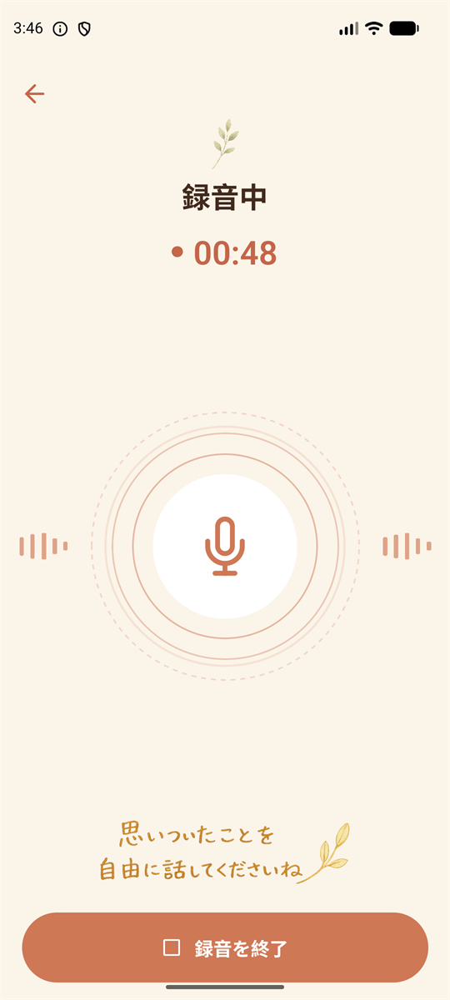
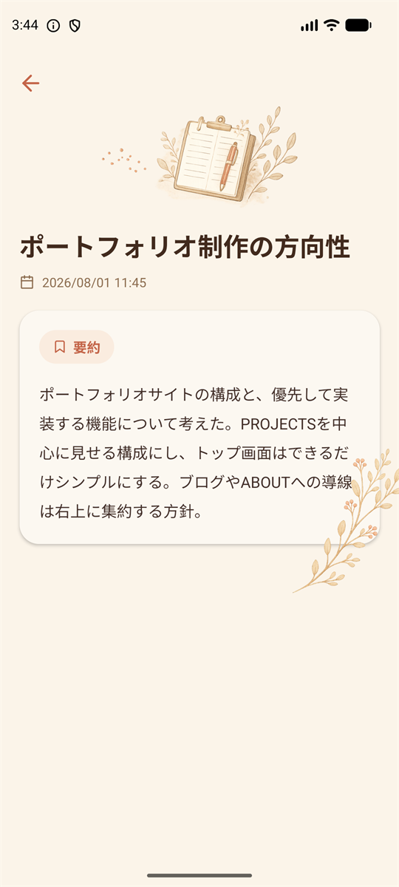

# 独り言要約（VoiceLeaf）

話すだけで、頭の中をスッキリ整理する Android アプリ。

思いついたことを声に出すだけで、AI がタイトルと要約に整えて端末内に保存します。
文章を書く手間なしに、後から振り返れる記録が残ります。

<p align="center">
  
  
  
</p>

---

## コンセプト

思いついたアイデアや考えを文章として入力するのは手間がかかり、その場で記録しなかった内容は忘れてしまいます。
このアプリは、**「書く」ことを一切求めない**ことで、その手間を取り除きます。

- **話すだけで完結する** — 録音を止めれば、AI がタイトルと要約を作って保存まで済ませる
- **見返すのは要約だけ** — 文字起こし全文ではなく、後から読んで内容がわかる要約だけを残す
- **音声は残さない** — 録音した音声は AI に渡すための一時ファイルで、処理後に必ず削除する

UI は「思考を整理する時間」に寄り添うよう、紙とインクを思わせる配色と手描き風のイラストで構成しています。

---

## 主な機能

| 機能 | 説明 |
| --- | --- |
| 音声録音 | 最大3分。経過時間を表示し、3分に到達すると自動で終了する |
| AIによるタイトル・要約生成 | 録音音声を Gemini API へ送り、内容を表すタイトルと要約を取得する |
| 見出しの自動付与 | 話題が複数にわたる場合のみ、要約内に見出しを付ける |
| 端末内保存 | 録音日時・タイトル・要約を端末内に保存し、アプリを再起動しても復元する |
| 一覧・詳細表示 | 録音日時の新しい順に一覧表示し、タップで詳細を確認できる |
| スワイプ削除 | 一覧項目を左スワイプして現れるゴミ箱ボタンから削除する |
| 事前チェック | 録音開始前にインターネット接続とマイク権限を確認する |
| 一時音声の自動削除 | 成功・失敗・中断のいずれの場合も、一時音声ファイルを削除する |

---

## 技術スタック

| 分類 | 採用技術 |
| --- | --- |
| フレームワーク | React Native / Expo (SDK 57) |
| 言語 | TypeScript |
| ルーティング | expo-router（ファイルベース） |
| 録音 | expo-audio |
| 永続化 | AsyncStorage |
| AI | Gemini API (`gemini-3.6-flash`) — REST を直接呼び出し |
| 状態管理 | React Context + hooks |
| ジェスチャー | react-native-gesture-handler |
| アニメーション | React Native 標準の Animated API |

**バックエンドサーバーを持たず**、アプリから Gemini API を直接呼び出す構成です。
音声は Base64 のインラインデータとして送信し、`responseSchema` による構造化出力でタイトルと要約を受け取ります。

---

## アーキテクチャ

UI から直接 API やストレージを呼ばず、サービス層を1枚挟む構成です。
サービス層は React に依存しない純粋な関数として実装しています。

```
app/                        expo-router のルート（画面）
├─ _layout.tsx              Stack定義 / Provider配置
├─ index.tsx                SCR-01 トップ画面
├─ record.tsx               SCR-02 録音画面（録音中／要約中を内包）
└─ detail/[id].tsx          SCR-03 詳細画面

src/
├─ components/              画面をまたいで使う表示部品
├─ contexts/                記録一覧の保持と追加・削除
├─ hooks/                   useRecorder（録音の状態機械）
├─ services/                storage / audio / gemini / network
├─ theme/                   カラー・タイポグラフィ・レイアウトのトークン
└─ config.ts                APIキーとモデル名
```

録音画面は画面を追加せず、`preparing → recording → processing` の状態遷移だけで
「録音中」と「要約しています」を切り替えます。
終了・中断・失敗のどの経路でも、一時音声ファイルの削除を経てトップ画面へ戻ります。

---

## 動作環境

- Node.js 22 以降
- Android エミュレータ（Expo Go で実行）
- Gemini API キー（無料利用枠）

## セットアップ

```bash
# 1. 依存をインストール
npm install

# 2. APIキーを設定
cp .env.example .env
#    .env を開き GEMINI_API_KEY に取得したキーを記入する

# 3. エミュレータを起動（ホストPCのマイク入力を許可する）
emulator -avd <AVD名> -allow-host-audio

# 4. 開発サーバーを起動
npx expo start --android
```

`.env` は `.gitignore` に登録済みで、APIキーがリポジトリに含まれることはありません。

---

## ドキュメント

要件定義から設計、受け入れ条件の確認までを文書として残しています。

| 文書 | 内容 |
| --- | --- |
| [要件定義書](docs/01-requirements.md) | 解決したい課題、機能要件、データ要件、受け入れ条件 |
| [設計書](docs/02-design.md) | アーキテクチャ、画面設計、API連携、デザイン仕様、設計判断の記録 |
| [検証結果](docs/03-verification.md) | 受け入れ条件 AC-01〜20 の確認結果 |

設計書の12章には、**なぜその選択をしたか**を19項目にわたって記録しています。
（AsyncStorage を選んだ理由、Expo Go 上で reanimated が使えなかった際の代替手段など）

---

## スコープ外

個人利用を目的としているため、次の機能は意図的に実装していません。

ユーザー登録 / ログイン / 複数端末の同期 / クラウドバックアップ /
オフライン録音 / 音声の再生・永続保存 / 文字起こし全文の表示 /
タイトル・要約の編集 / 検索 / タグ / 共有 / 通知 / 多言語対応

---

## 制作について

学習およびポートフォリオを目的とした個人開発です。ストアへの公開は行っていません。

画面デザインは事前に確定させたデザイン画像を基準に実装しています。
明朝体や手書き風の文字は標準フォントでは再現できないため、
タイトルなど一部のテキストは画像として配置しています。
