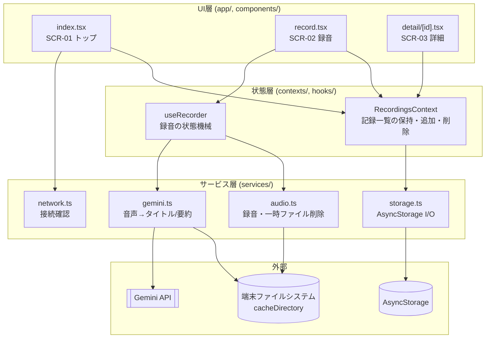
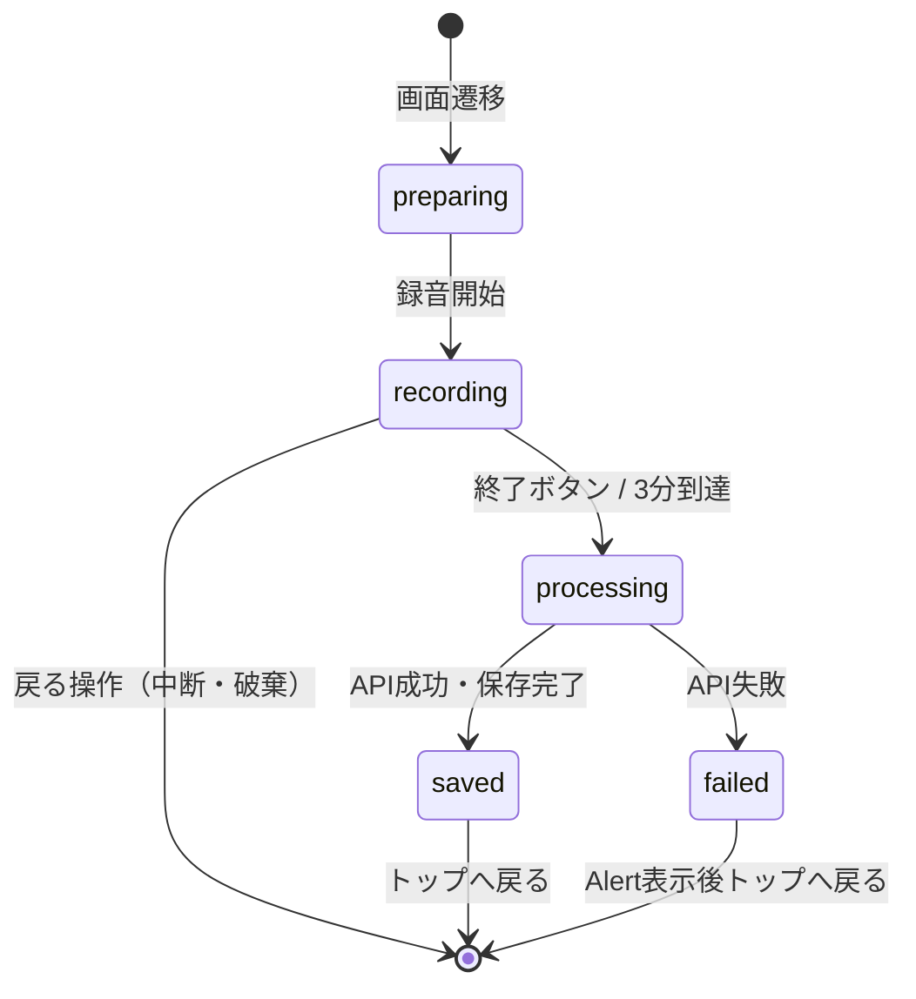
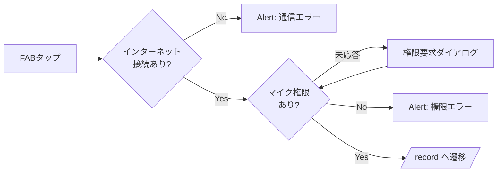
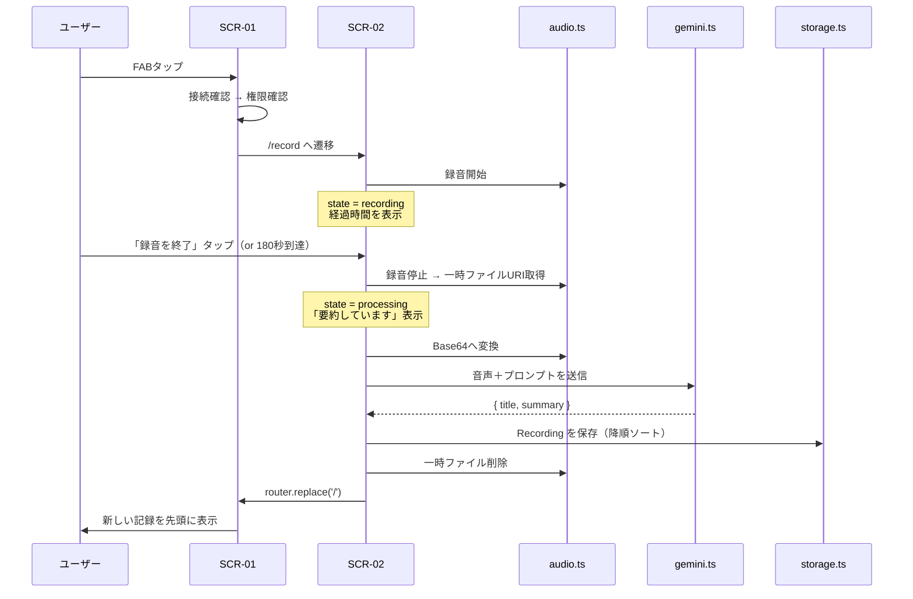
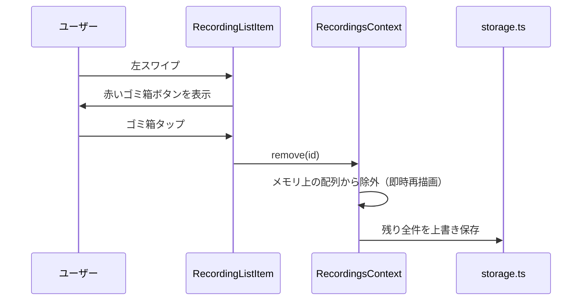

# 1. 基本情報

| 項目 | 内容 |
| --- | --- |
| システム名 | 独り言要約（VoiceLeaf） |
| 文書種別 | 基本設計書 |
| 文書バージョン | 1.0 |
| 最終更新日 | 2026-08-02 |
| 対応要件定義 | [01-requirements.md](01-requirements.md) v0.1 |
| デザイン基準 | [designs/voiceleaf-ui-design.png](../designs/voiceleaf-ui-design.png) |

---

# 2. 設計方針

要件定義の非機能要件「将来拡張を前提とした過剰な設計を行わず、現在の機能を維持できる構成とすること」に従い、以下を設計の原則とする。

1. **バックエンドを持たない** — アプリ内で録音・API呼び出し・保存が完結する。
2. **抽象化は1段まで** — UI から直接 API/Storage を叩かず、サービス層を1枚挟む。それ以上のDI・リポジトリパターン等は導入しない。
3. **状態管理ライブラリを入れない** — 画面3枚・共有状態1つ（記録一覧）のため、React 標準の Context + hooks で足りる。
4. **音声はメモリと一時ファイルのみ** — 永続化するのは記録テキストだけ。
5. **デザイン画像を実装の一次基準とする** — 配色・角丸・余白はトークン化し、画面コードに直値を書かない。

---

# 3. 技術スタック

| 分類 | 採用技術 | 選定理由 |
| --- | --- | --- |
| フレームワーク | React Native / Expo (SDK 57) | 要件定義の制約 |
| 言語 | TypeScript | 型による自己文書化。記録データの構造が固定のため効果が高い |
| 実行形態 | Expo Go（Androidエミュレータ） | 使用ライブラリが全て Expo Go 同梱。開発ビルド作成の手間を省く |
| ルーティング | expo-router | Expo標準。3ファイルでルート定義が完結する |
| 録音 | expo-audio | `expo-av` は非推奨化済みのため後継を採用 |
| ファイル操作 | expo-file-system | 一時音声のBase64化・削除 |
| 通信確認 | expo-network | 録音開始前の接続確認（FN-02） |
| 永続化 | @react-native-async-storage/async-storage | 記録は単一コレクション・検索なし。SQLiteは過剰 |
| スワイプ削除 | react-native-gesture-handler (`Swipeable`) | 左スワイプでゴミ箱ボタン表示（FN-14）。Animated ベースの実装を使う |
| アニメーション | React Native 標準の `Animated` API | 録音中の波形・処理中スピナー。reanimated は使用しない（12章 #17） |
| AI | Gemini API `gemini-2.5-flash`（REST直接呼び出し） | 音声入力対応・無料枠内。SDKを挟まず `fetch` で呼ぶ |
| アイコン | @expo/vector-icons | マイク・ゴミ箱・矢印等 |

> **SDKに含まれないもの**：状態管理ライブラリ、HTTPクライアント、Markdownライブラリ、UIコンポーネントライブラリ。いずれも本アプリの規模では不要と判断。

---

# 4. アーキテクチャ構成

## 4.1 レイヤー構成



**依存の向きは上から下の一方向のみ**とする。サービス層は React に依存せず、純粋な関数として実装する。

## 4.2 ディレクトリ構成

```text
voiceleaf/
├─ app/                        # expo-router のルート（画面）
│  ├─ _layout.tsx              # Stack定義 / Provider配置 / 起動時クリーンアップ
│  ├─ index.tsx                # SCR-01 トップ画面
│  ├─ record.tsx               # SCR-02 録音画面（録音中／要約中を内包）
│  └─ detail/[id].tsx          # SCR-03 詳細画面
│
├─ src/
│  ├─ components/
│  │  ├─ RecordingListItem.tsx # 一覧カード＋左スワイプ削除
│  │  ├─ MicButton.tsx         # 録音開始FAB（白リング付き）
│  │  ├─ WaveIndicator.tsx     # 録音中の波形・同心円装飾
│  │  ├─ SummaryText.tsx       # 簡易Markdownレンダラー
│  │  ├─ BackButton.tsx        # 戻る「←」（SCR-02 / SCR-03 共通）
│  │  └─ Illustration.tsx      # 装飾イラストの配置ラッパー
│  │
│  ├─ contexts/
│  │  └─ RecordingsContext.tsx # 一覧state + load/add/remove
│  │
│  ├─ hooks/
│  │  └─ useRecorder.ts        # 録音の状態機械（4.3参照）
│  │
│  ├─ services/
│  │  ├─ storage.ts            # 記録のCRUD（AsyncStorage）
│  │  ├─ audio.ts              # 録音制御・Base64化・一時ファイル削除
│  │  ├─ gemini.ts             # Gemini API 呼び出し
│  │  ├─ prompt.ts             # システムプロンプト・responseSchema
│  │  └─ network.ts            # 接続確認
│  │
│  ├─ theme/
│  │  ├─ colors.ts             # 8章のカラートークン
│  │  ├─ typography.ts         # フォントサイズ・行間
│  │  └─ layout.ts             # 余白・角丸・影
│  │
│  ├─ types.ts                 # Recording 型など
│  └─ config.ts                # APIキー・モデル名の読み出し
│
├─ assets/
│  └─ images/                  # デザイン画像から切り出したイラストPNG
│
├─ docs/
├─ designs/
├─ app.config.js               # .env → extra へ受け渡し
├─ .env                        # APIキー（Git管理外）
├─ .env.example                # キー名のみ記載（Git管理対象）
└─ .gitignore
```

## 4.3 録音画面の状態機械

録音画面は新しい画面を追加せず、内部状態の切り替えで「録音中」「要約しています」を表現する（要件 5.1）。



| 状態 | 画面表示 | 操作の可否 |
| --- | --- | --- |
| `preparing` | 録音画面のレイアウト（タイマー `00:00`） | 戻るのみ |
| `recording` | 「録音中」＋経過時間＋波形アニメーション＋「録音を終了」ボタン | 終了・戻る |
| `processing` | 「要約しています」＋スピナー。戻るボタン・終了ボタンとも非表示 | **全操作を受け付けない**（Androidバックキーも無効化） |
| `saved` / `failed` | — | 自動でトップへ遷移 |

> `processing` 中は戻るボタンを非表示にしたうえで、ハードウェアバックキーを `BackHandler` で握りつぶし、FN-08「AI処理中は追加操作を受け付けない」を満たす。

---

# 5. データ設計

## 5.1 データモデル

```ts
// src/types.ts
export type Recording = {
  id: string;          // 生成: `${Date.now()}-${乱数}`（衝突しない粒度で十分）
  recordedAt: string;  // ISO 8601 (例: "2026-08-01T11:45:23.000Z") 録音"開始"時刻
  title: string;       // Geminiが生成
  summary: string;     // Geminiが生成（Markdown。見出しは "## " のみ許可）
};
```

## 5.2 永続化仕様

| 項目 | 内容 |
| --- | --- |
| ストア | AsyncStorage |
| キー | `voiceleaf.recordings.v1` |
| 値 | `Recording[]` を `JSON.stringify` した文字列 |
| 並び | **保存時に `recordedAt` 降順でソートして書き込む**（FN-12） |
| 読み込み | アプリ起動時に1回（`RecordingsContext` のマウント時）。以降はメモリ上の配列を正とする |
| 書き込み | 追加・削除のたびに全件を上書き |

パース失敗時（データ破損）は空配列にフォールバックし、ローカルログに出力する。要件上、復旧処理は行わない。

## 5.3 一時音声ファイル

| 項目 | 内容 |
| --- | --- |
| 保存先 | `FileSystem.cacheDirectory` 配下（expo-audio が生成する一時URIをそのまま使用） |
| 形式 | m4a / AAC（`RecordingPresets.HIGH_QUALITY`） |
| 想定サイズ | 3分でおよそ 2〜3MB（Base64化して 3〜4MB） |
| 削除タイミング | 下記すべてのケースで `finally` 節から削除（FN-16） |

削除が必要なケース：
- AI処理成功後
- AI処理失敗後
- 録音中断時（戻る操作）
- 録音自体のエラー時

さらに保険として、**アプリ起動時に cacheDirectory 内の残存音声ファイルを削除**する。プロセスキル等で削除処理が走らなかった場合に備える。

---

# 6. 画面設計

## 6.1 画面構成とルート

| ID | ルート | ファイル | 遷移方法 |
| --- | --- | --- | --- |
| SCR-01 | `/` | `app/index.tsx` | 起動時 |
| SCR-02 | `/record` | `app/record.tsx` | FAB タップ → `router.push` |
| SCR-03 | `/detail/[id]` | `app/detail/[id].tsx` | 一覧タップ → `router.push` |

ヘッダーは全画面で expo-router の標準ヘッダーを無効化し、画面内で自前描画する（デザイン画像の詳細画面ヘッダーに合わせるため）。

## 6.2 SCR-01 トップ画面

```text
┌─────────────────────────────┐
│ 🌿 独り言要約                │ ← 明朝系・大見出し・左に葉の装飾
│    話すだけで、頭の中をスッキリ整理。│ ← サブコピー（ミュート色）
│                             │
│ ┌─────────────────────────┐ │
│ │ 📄  2026/08/01        › │ │ ← カード：白背景・角丸16・薄い影
│ │     ポートフォリオ制作の方向性  │ │    日付=アクセント色/小、タイトル=濃茶/中
│ └─────────────────────────┘ │
│ ┌─────────────────────────┐ │
│ │ ...                     │ │ ← FlatList（recordedAt 降順）
│ └─────────────────────────┘ │
│                             │
│  🪴      ( 🎤 )      ☕     │ ← FAB：テラコッタ円＋白リング
│         📖                  │ ← 左右下部にイラストPNGを絶対配置
└─────────────────────────────┘
```

| 要素 | 仕様 |
| --- | --- |
| 一覧 | `FlatList`。`ListEmptyComponent` で記録0件時の案内文を表示（デザインに無いため文言のみ、装飾は最小） |
| カードタップ | `/detail/[id]` へ遷移 |
| 左スワイプ | `ReanimatedSwipeable` の `renderRightActions` で赤いゴミ箱ボタンを表示（幕出し幅 80px） |
| ゴミ箱タップ | 確認ダイアログ**なし**で即削除（FN-15）。削除後にリストを再描画 |
| FAB | 6.4 の事前チェックを通過した場合のみ `/record` へ遷移 |
| イラスト | 画面下部に `position: absolute` で配置。FAB より低い zIndex に置き、タップを妨げない |

## 6.3 SCR-02 録音画面

```text
┌─────────────────────────────┐
│ ←                           │ ← 戻る（録音中断）。processing時は非表示
│            🌿               │
│          録音中             │ ← processing時は「要約しています」
│         ● 00:42             │ ← recording時のみ。●は点滅
│                             │
│      ╭───────────╮          │
│  ⋮⋮  │    🎤     │  ⋮⋮      │ ← 同心円リング＋左右の波形バー
│      ╰───────────╯          │    processing時はスピナーに差し替え
│                             │
│      思いついたことを         │
│    自由に話してくださいね      │
│                             │
│   ┌───────────────────┐     │
│   │  ■  録音を終了     │     │ ← processing時は非表示
│   └───────────────────┘     │
└─────────────────────────────┘
```

| 要素 | 仕様 |
| --- | --- |
| 戻るボタン | 画面左上に配置。詳細画面（SCR-03）と同一のスタイル・サイズ・位置とする |
| 経過時間 | `mm:ss` 形式。100ms間隔のタイマーで更新し、表示は秒単位 |
| 自動終了 | 経過180秒で `stop()` を自動実行（FN-06） |
| 波形 | 実音量には連動させず、`Animated.loop` による繰り返しアニメーションで表現（デザイン再現目的） |
| 中断操作 | 戻るボタン・Androidバックキーのどちらでも中断できる。**両者は同一の処理を呼ぶ**（録音停止 → 一時ファイル削除 → 保存せずトップへ戻る） |
| processing表示 | 見出しを「要約しています」に、マイクアイコンをスピナーに、戻るボタンと下部ボタンを非表示に切り替え。同心円装飾は維持 |

## 6.4 録音開始の事前チェック

FAB タップ時、以下の順で確認する（FN-02, FN-03）。いずれかで失敗した場合は Alert を表示し、**トップ画面にとどまる**。



## 6.5 SCR-03 詳細画面

```text
┌─────────────────────────────┐
│ ←                           │ ← 戻るのみ。タイトル・三点リーダーは配置しない
│                             │
│        📋(イラスト)          │
│                             │
│  ポートフォリオ制作の方向性     │ ← 明朝系・大
│  📅 2026/08/01 11:45        │ ← ミュート色・小
│                             │
│ ┌─────────────────────────┐ │
│ │ 🔖 要約                  │ │ ← バッジ：薄いテラコッタ背景の角丸ピル
│ │                         │ │
│ │ 本文テキスト……            │ │ ← 行間ゆったり（1.9em程度）
│ │                         │ │
│ └─────────────────────────┘ │
└─────────────────────────────┘
```

- ヘッダーは戻るボタンのみとする。デザイン画像にある「詳細」タイトルは冗長なため、三点リーダーボタンは要件に対応する機能がないため、**いずれも配置しない**。
- 表示データは `id` を使って `RecordingsContext` から取得する（再度ストレージを読まない）。
- `id` が見つからない場合はトップへ戻す。
- 本文は `SummaryText` でレンダリング（7.3）。

---

# 7. Gemini API 連携設計

## 7.1 リクエスト仕様

| 項目 | 内容 |
| --- | --- |
| エンドポイント | `POST https://generativelanguage.googleapis.com/v1beta/models/{model}:generateContent` |
| モデル | `gemini-3.6-flash`（`src/config.ts` で定数化し、変更可能にする） |
| 認証 | ヘッダー `x-goog-api-key: <APIキー>` |
| 音声の渡し方 | `inline_data`（Base64）。3分でも上限20MBに収まるため Files API は使わない |
| MIMEタイプ | `audio/mp4` |
| 出力制御 | `generationConfig.responseMimeType: "application/json"` ＋ `responseSchema` |
| タイムアウト | 120秒（`AbortController`）。超過時はAI処理失敗として扱う |

リクエストボディの構造：

```jsonc
{
  "contents": [{
    "parts": [
      { "inline_data": { "mime_type": "audio/mp4", "data": "<base64>" } },
      { "text": "<指示プロンプト>" }
    ]
  }],
  "generationConfig": {
    "responseMimeType": "application/json",
    "responseSchema": {
      "type": "OBJECT",
      "properties": {
        "title":   { "type": "STRING" },
        "summary": { "type": "STRING" }
      },
      "required": ["title", "summary"]
    }
  }
}
```

## 7.2 プロンプト方針

`src/services/prompt.ts` に定数として持つ。要求する内容は以下のみとし、文字数などの細則は定義しない（要件 6.1）。

- 音声は日本語の独り言・アイデアメモである
- `title`：内容を表す短いタイトル
- `summary`：後から読んで内容を理解できる要約
- 話題が複数にわたる場合のみ `## 見出し` を使ってよい。単一の話題では見出しを付けない（FN-10）
- 使用してよい記法は `## 見出し` と改行のみ。箇条書き・強調・コードブロックは使わない
- 音声が無音・聞き取れない場合も、その旨を `summary` に書いて返す

## 7.3 要約テキストのレンダリング

Markdownライブラリは導入せず、`SummaryText.tsx` で以下だけを解釈する。

| 入力 | 出力 |
| --- | --- |
| `## ` で始まる行 | 見出しスタイルの `<Text>`（濃茶・太め・上マージン） |
| 空行 | 段落の区切り（下マージン） |
| その他の行 | 本文スタイルの `<Text>` |

プロンプトで記法を制限しているため、これで表示要件を満たす。想定外の記法が来ても、プレーンテキストとしてそのまま表示されるだけで破綻しない。

## 7.4 レスポンス処理

1. HTTPステータスが 2xx 以外 → 失敗
2. `candidates[0].content.parts[0].text` を取り出す
3. `JSON.parse` して `title` / `summary` が非空文字列であることを確認
4. いずれか欠けていれば失敗

失敗時は例外を投げ、呼び出し元（`useRecorder`）でまとめてハンドリングする。**要件により再試行は行わない**。

---

# 8. デザイン仕様

## 8.1 カラートークン

デザイン画像から実測した値を `src/theme/colors.ts` に定義する。

| トークン | 値 | 用途 |
| --- | --- | --- |
| `bg` | `#FBF4E9` | 画面背景（クリーム） |
| `surface` | `#FCF8F1` | カード・要約ボックス背景 |
| `primary` | `#CE7856` | 録音FAB、終了ボタン、マイクアイコン（テラコッタ） |
| `accent` | `#C4664A` | 一覧の日付、録音タイマー、要約バッジ文字 |
| `accentSoft` | `#FAECDF` | 要約バッジ背景、一覧アイコンの下地 |
| `textPrimary` | `#43302A` | 本文・一覧タイトル |
| `textHeading` | `#422B1E` | アプリタイトル・詳細タイトル |
| `textMuted` | `#8E6F52` | サブコピー、録音画面のヒント、日時表示 |
| `leaf` | `#AE9E74` | 葉・草花の装飾 |
| `danger` | `#D9463D` | スワイプ削除ボタン |
| `white` | `#FFFFFF` | FABのリング |

## 8.2 タイポグラフィ

デザイン画像は明朝体（セリフ系）が使われているが、**カスタムフォントは同梱せず、Android標準のゴシック体（Noto Sans CJK）を使用する**。フォント同梱によるアプリサイズ増加と起動時のフォント読み込み待ちを避けるため。

デザイン画像との印象差は、フォントウェイトと行間で補う。

- 見出しは太めのウェイト（700）でコントラストを付ける
- 本文の行間を広めに取り、明朝体のゆったりした印象に近づける
- `fontFamily` は指定せず、OS標準フォントに委ねる

| スタイル | サイズ | ウェイト | 色 |
| --- | --- | --- | --- |
| アプリタイトル | 32 | 700 | `textHeading` |
| 画面見出し（録音中/詳細タイトル） | 26〜28 | 700 | `textHeading` |
| 一覧タイトル | 16 | 500 | `textPrimary` |
| 一覧日付 | 13 | 500 | `accent` |
| 本文（要約） | 16 / 行間 30 | 400 | `textPrimary` |
| ヒント・サブコピー | 13 | 400 | `textMuted` |
| タイマー | 30 | 600 | `accent` |

## 8.3 レイアウトトークン

| トークン | 値 |
| --- | --- |
| 画面左右パディング | 20 |
| カード角丸 | 16 |
| カード内パディング | 16 |
| カード間隔 | 12 |
| ボタン角丸（録音を終了） | 32（ピル） |
| FABサイズ | 直径 76（白リング幅 6 を含めて 88） |
| 戻るボタン | アイコン 26 / タップ領域 44×44 / 画面左上（左20・上12） |
| 影 | `shadowOpacity: 0.06 / radius: 8 / offset(0,2)` ＋ Android `elevation: 2` |
| 最小タップ領域 | 44×44 以上（非機能要件のアクセシビリティ） |

## 8.4 イラスト素材

デザイン画像から以下を切り出し、`assets/images/` に配置する（背景透過PNG）。

| ファイル | 使用画面 | 配置 |
| --- | --- | --- |
| `leaf-title.png` | SCR-01 | タイトル左上 |
| `deco-bottom-left.png`（植物） | SCR-01 | 左下 |
| `deco-bottom-right.png`（コーヒー・本） | SCR-01 | 右下 |
| `leaf-small.png` | SCR-02 | 見出し上部 |
| `deco-note.png`（ノート・ペン） | SCR-03 | ヘッダー下 |
| `deco-branch.png`（枝） | SCR-03 | 要約ボックス右下 |

紙のような背景テクスチャは、切り出すと画面サイズに合わず不自然になるため**再現対象から外し、単色 `bg` とする**。

---

# 9. エラー設計

エラー表示は `Alert.alert` に統一する（FN-17）。

| 発生箇所 | 条件 | 表示 | 事後処理 |
| --- | --- | --- | --- |
| トップ画面 | インターネット未接続 | 「インターネットに接続されていません。接続を確認してからもう一度お試しください。」 | 遷移しない |
| トップ画面 | マイク権限が拒否 | 「マイクの使用が許可されていません。端末の設定から許可してください。」 | 遷移しない |
| 録音画面 | 録音開始に失敗 | 「録音を開始できませんでした。」 | 一時ファイル削除 → トップへ戻る |
| 録音画面 | API失敗／タイムアウト／レスポンス不正 | 「要約に失敗しました。もう一度お試しください。」 | **記録は保存しない**。一時ファイル削除 → トップへ戻る |
| 詳細画面 | 記録が見つからない | Alertなし | トップへ戻る |

- 保存（AsyncStorage書き込み）の失敗は、要件に定義がないためローカルログ出力のみとする。
- ネットワークエラーの詳細（ステータスコード等）は `console.warn` で開発時ログに出す。ユーザーには表示しない。

---

# 10. APIキー管理

AC-20（APIキーがGit管理対象に含まれていない）を満たす構成。

```text
.env                    ← 実際のキー。.gitignore に登録（Git管理外）
  GEMINI_API_KEY=xxxxx

.env.example            ← キー名のみ。Git管理対象
  GEMINI_API_KEY=

app.config.js           ← .env を読み、extra へ受け渡す
  extra: { geminiApiKey: process.env.GEMINI_API_KEY }

src/config.ts           ← Constants.expoConfig.extra から読み出す
```

- Expo は `.env` を自動で読み込むため、追加ライブラリは不要。
- `src/config.ts` でキーが未設定の場合、起動時に開発者向けの警告ログを出す。
- `.gitignore` に `.env` `.env.local` を必ず含める。

> **注記**：この方式でもビルド成果物内にはキーが含まれる。ストア公開・配布を行わない前提（要件 10.1）のため許容する。

---

# 11. 主要処理フロー

## 11.1 録音から保存まで



## 11.2 削除



削除はメモリ上の state を先に更新して即座に一覧へ反映し、ストレージ書き込みは非同期で行う。確認ダイアログは表示しない（FN-15）。

---

# 12. 設計上の決定事項

ディスカッションで確定した内容の記録。

| # | 論点 | 決定 | 理由 |
| --- | --- | --- | --- |
| 1 | 記録の永続化 | AsyncStorage | 検索・タグが実装対象外で、件数も個人利用規模。SQLiteのスキーマ管理は過剰 |
| 2 | APIキー管理 | `.env` + `app.config.js` | AC-20を満たす最小構成。アプリ内設定画面は画面一覧（SCR-01〜03）を超えるため不採用 |
| 3 | ナビゲーション | expo-router | Expo標準。3ファイルで完結 |
| 4 | イラスト素材 | デザイン画像から切り出してPNG化 | AC-02（目視比較）の再現度が最も高い |
| 5 | 要約の見出し | Markdown保存＋自作の簡易レンダラー | 保存形式が単純な文字列のままで済み、FN-10も満たせる。外部ライブラリ不要 |
| 6 | エラー表示 | `Alert.alert` | エラーは例外パス。実装コストゼロで確実に伝わる |
| 7 | Geminiモデル | `gemini-3.6-flash` | 当初は `gemini-2.5-flash` を選定したが、2.5系（lite含む）は新規ユーザーへの提供が終了しており 404 になることが疎通確認で判明したため、後継の 3.6-flash に変更。音声入力・構造化出力ともに動作を確認済み。モデル名は定数化し変更可能にしてある |
| 8 | 処理中表示 | 録音画面のレイアウトを流用 | 画面を追加せず状態切り替えで実現するという要件 5.1 に合致 |
| 9 | 状態管理 | React Context + hooks | 共有状態は記録一覧のみ。ライブラリ導入は過剰 |
| 10 | 実行形態 | Expo Go | 使用ライブラリが全て同梱。開発ビルド不要 |
| 11 | 波形アニメーション | 実音量に非連動 | 実音量メータリングは装飾目的に対して複雑さが見合わない |
| 12 | 背景テクスチャ | 再現しない（単色） | 切り出しても画面サイズに追随せず不自然になるため |
| 13 | フォント | カスタムフォントを同梱せず、Android標準のゴシック体を使用 | 明朝体の同梱によるアプリサイズ増加と起動時の読み込み待ちを避ける。印象差はウェイトと行間で補う |
| 14 | 録音画面の中断手段 | 左上に戻るボタン「←」を配置（SCR-03と同一スタイル） | デザイン画像には無いが、画面上に中断手段が見えないのはユーザビリティ上の問題となるため追加する |
| 15 | 詳細画面の三点リーダー | 配置しない | 対応する機能が要件に存在せず、押しても何も起きないボタンになるため |
| 16 | 詳細画面の「詳細」タイトル | 配置しない | 直下にタイトル・日時・要約が並ぶため冗長 |
| 17 | react-native-reanimated | 使用しない（依存から除去） | Expo Go (SDK 57) 上でアプリ起動と同時にJSスレッドが SIGSEGV クラッシュするため。`libworklets.so` が原因で、gesture-handler の有無やBabel設定とは無関係に再現した。アニメーションは標準の `Animated` API で代替する（12章 #11 のとおり波形は装飾目的のため実用上の差はない） |

---

# 13. 実装順序（推奨）

要件定義の未決事項（エミュレータのマイク入力、デザイン再現度）を早期に潰す順序とする。

| # | 内容 | 検証する未決事項 |
| --- | --- | --- |
| 1 | プロジェクト初期化・依存導入・`.env`／`app.config.js` 整備 | AC-20 |
| 2 | **録音の動作確認**（最小UIで録音→ファイル生成まで） | エミュレータのマイク入力（最優先） |
| 3 | **Gemini API疎通**（録音ファイル→タイトル/要約取得） | AC-11 |
| 4 | テーマ・トークン定義、イラスト切り出し | AC-02 |
| 5 | SCR-01 トップ画面（一覧・FAB・スワイプ削除） | AC-13, AC-16, AC-17 |
| 6 | SCR-02 録音画面（録音中／要約しています） | AC-06, AC-07, AC-10 |
| 7 | SCR-03 詳細画面（Markdownレンダリング） | AC-14 |
| 8 | 永続化・起動時復元・一時ファイル削除の通し確認 | AC-15, AC-18, AC-19 |
| 9 | 異常系（通信断・権限拒否・API失敗）の確認 | AC-04, AC-19 |

ステップ2と3で問題が出た場合、設計を見直したうえでUI実装に進む。
